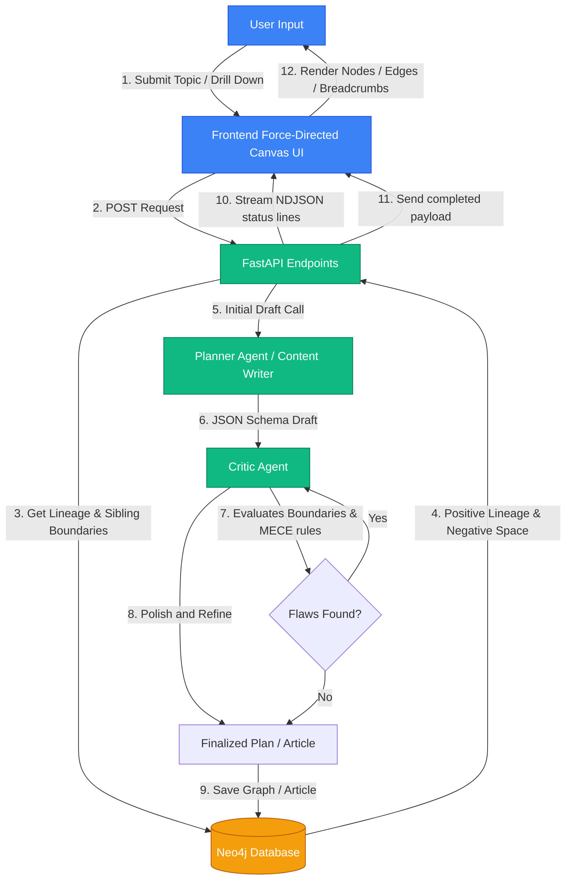
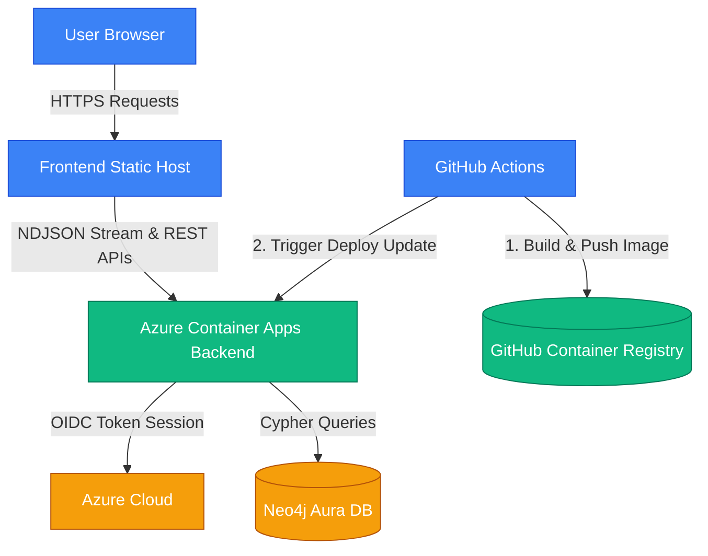

# Agentic MECE Mindmap Builder

[](https://github.com/LaurentVeyssier/mindmap-app/actions/workflows/deploy-backend.yml)

An enterprise-grade, agent-driven visual knowledge graph builder that decomposes complex subjects into **MECE (Mutually Exclusive, Collectively Exhaustive)** structural taxonomies. The system coordinates specialized Gemini agents (Planner, Content Writer, and Critic) to draft, refine, and dynamically drill down into concept subgraphs, persisted in real time to a **Neo4j Graph Database**.

---

## System Architecture & Process Flow

The diagram below outlines the end-to-end request flow. When a user submits a topic or drills down into a concept, the backend queries the database for context boundaries, routes lineage data to the drafting agents, triggers a Critic review cycle, persists the finalized structure, and streams real-time progression stages to the UI.



---

## Key Features

### 1. MECE Decomposition (Mutually Exclusive, Collectively Exhaustive)
Guided by expert system instructions, the **Planner Agent** breaks down any domain into balanced, non-overlapping conceptual divisions (Level 1 concepts), radiating into exactly 3 distinct foundational sub-points (Level 2 leaves). Sibling concepts are vertically disjoint, maintaining clean thematic separation without duplicate cross-linking.

### 2. State-Aware Subgraph Isolation Protocol (Negative Space Boundaries)
To solve the classic semantic bleeding problem where a subgraph repeats parent-level concepts, the system uses a state-aware prompt protocol:
*   **Positive Lineage**: The exact breadcrumb path from the root topic is injected into the prompt.
*   **Negative Space**: A dynamic Cypher query maps every other active node in the graph. These nodes are fed to the agent as off-limits territory (boundaries) so the subgraph is strictly isolated.
*   **Altitude Zoom Control**: Forces the agent to transition from strategic/architectural terminology (high altitude) to tactical/operational implementation details (low altitude) when expanding subgraphs.

### 3. Double-Pass Critic Validation Cycle
Before saving graph changes or generating articles, a **Critic Agent** running on a stronger Gemini model (e.g. `gemini-3.5-flash`) reviews the candidates:
*   Analyzes structural disjointness, relationship naming, and guideline compliance.
*   *Strict Validation Rule*: The Critic only recommends changes or regenerates if it identifies flaws or missing dimensions; otherwise, it proceeds with the candidate immediately (no unnecessary latency).

NOTE: Critic Agent can be disabled in the backend settings. Set .env variable USE_CRITIC to False (default is True) to disable it. In Azure, set USE_CRITIC to false in the container settings (environment variables) or through azure CLI:

```azurecli
az containerapp update `
  --name mindmap-backend `
  --resource-group mindmap-rg `
  --set-env-vars USE_CRITIC=False
```

### 4. Interactive Force Graph UI & Navigation
*   **Breadcrumbs Nav**: Tracks zoom level and anchors navigation back to root or intermediate parent subgraphs. On mobile, the breadcrumbs stack dynamically onto a separate row with swipeable horizontal scroll features.
*   **Concentric Highlights**: Central hub lines are highlighted with golden glow links, while leaf lines use structural grey branches.
*   **Details Sidebar**: Allows selecting any node (including the root topic node) to read, update, or write markdown articles. On mobile, the sidebar drawer dynamically transitions to `100%` viewport width, disabling the desktop-specific resize handles and maximize options.
*   **Auto-Centering Camera Panning**: Automatically centers the viewport on selected nodes with a custom offset that shifts the node into the visible area (left of the drawer panel) to prevent clipping.
*   **Responsive Spacing & physics**: Adjusts repulsion forces, link lengths, and collision paddings dynamically on small viewports. Skips rendering link relationship text labels and wraps long node titles onto multiple lines to prevent overlap clutter.

### 5. Multi-Graph Isolated Dashboard
*   Users can exit the active workspace to return to a visual homepage showing all saved mindmaps in a clean card layout.
*   Because every node and relationship is stamped with a unique `topic_id`, multiple independent mindmap workspaces are isolated and reloaded instantly on the same Neo4j database instance.

### 6. Real-time Progress Window
*   Generative actions return an `application/x-ndjson` stream.
*   The frontend uses a TextDecoder chunk parser to update a step-by-step progress checklist (Planner, Critic, DB Sync) in real time.

---

## Technology Stack

### Backend
*   **FastAPI**: API endpoints, CORS handling, and NDJSON streaming responses.
*   **Neo4j**: Database driver storing nodes, edges, properties, and hierarchy metadata.
*   **Google GenAI SDK**: Implements `google-genai` Client for structured schema outputs.
*   **uv**: Python packaging and environment manager.

### Frontend
*   **React + TypeScript + Vite**: Responsive Single Page App.
*   **react-force-graph-2d**: D3 force-directed physics engine canvas rendering.
*   **Vanilla CSS**: Glassmorphic panels, glowing boundaries, and custom CSS custom properties (no Tailwind CSS).

---

## Getting Started

### 1. Prerequisites
Ensure you have a running Neo4j Instance (Aura DB Free tier or local Desktop) and a Gemini API Key.

### 2. Backend Setup
1. Navigate to the backend directory:
   ```bash
   cd backend
   ```
2. Create a `.env` file in the `backend/` directory:
   ```env
   NEO4J_URI=neo4j+s://<your-instance-url>
   NEO4J_USERNAME=neo4j
   NEO4J_PASSWORD=<your-password>
   NEO4J_DATABASE=neo4j
   GEMINI_API_KEY=<your-api-key>
   PRIMARY_MODEL=gemini-3.5-flash
   CRITIC_MODEL=gemini-3.5-flash
   ```
3. Sync python dependencies and run the server using `uv`:
   ```bash
   uv sync
   uv run uvicorn app.main:app --port 8000 --host 127.0.0.1
   ```

### 3. Frontend Setup
1. Navigate to the frontend directory:
   ```bash
   cd ../frontend
   ```
2. Install Node dependencies:
   ```bash
   npm install
   ```
3. Run the development server:
   ```bash
   npm run dev
   ```
4. Open your browser and navigate to `http://localhost:5173/`.


## Production Deployment & Integration

The application uses a decoupled serverless hosting architecture, separating the client interface from the agent orchestration compute engine.

### Frontend Deployment
*   **Static Hosting**: The React client is compiled into highly optimized static assets (HTML/JS/CSS) via Vite (`npm run build`). These assets are hosted on static web hosting services (such as Azure Static Web Apps, Vercel, Netlify, or GitHub Pages).
*   **Environment Configuration**: The frontend points to the backend API via the `VITE_API_URL` environment variable during compile time.

### Backend Deployment (Azure Container Apps)
The application's agent backend is continuously built and deployed to **Azure Container Apps (ACA)** using a serverless containerization flow managed by **GitHub Actions** ([deploy-backend.yml](file:///.github/workflows/deploy-backend.yml)).

#### Deployment Architecture



### Frontend-Backend Communication

The connection between the frontend and backend is established through two communication channels:

1.  **Standard REST APIs**: Lightweight transactional requests (fetching the dashboard list, retrieving graph details, deleting nodes, or exporting static HTML mindmaps).
2.  **Real-Time NDJSON Progress Streams**: Long-running asynchronous agent processes (creating mindmaps, writing detailed concept guides, and drilling down into subgraphs). The FastAPI backend uses a `StreamingResponse` to push incremental progress tokens (`application/x-ndjson`). The frontend uses a `ReadableStream` reader and `TextDecoder` to parse these events in real time, rendering live status logs to the user.

### Chosen Deployment Approach: Raw Docker & Serverless
*   **Registry Hosting**: We utilize **GitHub Container Registry (GHCR)** (`ghcr.io`) to host versioned container images of the Python backend context.
*   **OIDC Authentication**: GitHub Actions authenticate with Azure via **OpenID Connect (OIDC)** federated credentials. This passwordless login eliminates the security risk of storing long-lived subscription credentials in the repository.
*   **Immutable Version Tracking**: Each image is built and tagged with the unique Git commit SHA (`${{ github.sha }}`) alongside `latest`. This ensures that every deployment is traceable, reproducible, and easily roll-backable in production.

### Benefits of this Architecture

*   **Zero Infrastructure Management**: Azure Container Apps runs on serverless Kubernetes (K8s) underneath, freeing developers from managing virtual machines, ingress controls, TLS certificates, or manual scaling policies.
*   **Scale-to-Zero Cost Efficiency**: The container scales down to `0` active replicas when no requests are received for a specific time, costing nothing during idle periods. 
*   **Automated DNS and TLS**: ACA automatically provides secure, publicly accessible HTTPS endpoints with managed SSL certificates out of the box.
*   **Fast Cold Starts**: Leverages lightweight base images ensuring ACA instances spin up quickly (usually 20-30 seconds) during scale-from-zero requests.


